## Contents

## Abstract

In this post, I present a proof of concept Edge AI embedded device that can be used to detect anomalies on watch wheels in real-time, a task that has been traditionally done by direct observation with rudimentary tools by an experienced watchmaker. The device is based on a state-of-art Edge AI microcontroller that performs image segmentation, landmark and pose detection of the wheels, an optical system that feeds macro video to a microcontroller and a display that shows a video stream with overlaid information to the user through an augmented reality interface. This proposal has been submitted to [Elektor STM32 Edge AI competition](https://www.elektormagazine.com/stm32ai).

## Rationale

I am a [professional engineer](https://jesus.engineer/#resume) and [amateur watchmaker](https://www.youtube.com/@jesusthewatchmaker) and bringing together the new field of Edge AI with the traditional art of horology looks like something I would love to do. This prototype intends to ideate a helpful tool that can be part of the quality control workflow of a watchmaker or precision machinist. This can be extended to QC in other precision manufacturing industries as well. Finally, this also serves as an exercise to validate if it is possible in 2025 to build a low-cost and low-power Edge AI device for such applications.

## Theory of operation

The most straightforward hardware configuration for this prototype consists of three parts:

1. A [STM32N6570-DK](https://www.st.com/en/evaluation-tools/stm32n6570-dk.html) discovery kit manufactured by STMicroelectronics containing a high-performance Arm® Cortex® M55 CPU with enhanced edge AI capability and a 5" LCD module with a capacitive touch panel.
1. A [B-CAMS-IMX](https://www.st.com/en/evaluation-tools/b-cams-imx.html) camera module from STMicroelectronics with a M12 macro lens.
1. A basic stand for the camera lens that lets you adjust the working distance from the camera module (it has a fixed focal length lens) to the wheel under test.

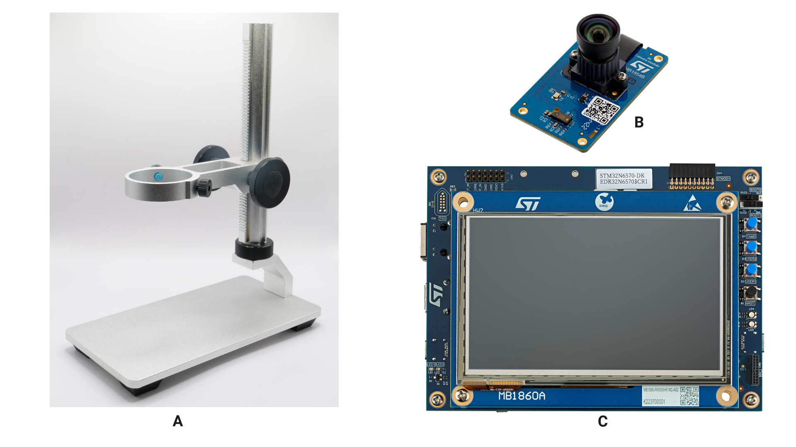

The wheel under test is placed under the camera module. The system is adaptative and works in real-time so no special care should be taken in placing the wheel in a particular pose or steadily as long as it is in focus.

Inspecting the watch wheels is an essential part of the process of servicing a watch by a watchmaker. There are 4 modes available that will let us measure different aspects of the wheel:

**Anomaly Detection Mode**

It detects coarse anomalies in the overall structure of the wheel. When servicing a watch it is very common to find broken or bent teeth, particularly on the wheels that have a higher torque like the ones in the keyless works (winding wheels). Fun fact: the 3 broken teeth in the ratchet wheel below were the cause of the failure of this [Oris Big Crown Pointer Date](https://youtu.be/sLatG9oVuu8?si=iLpATBQoDIkOIMZJ).

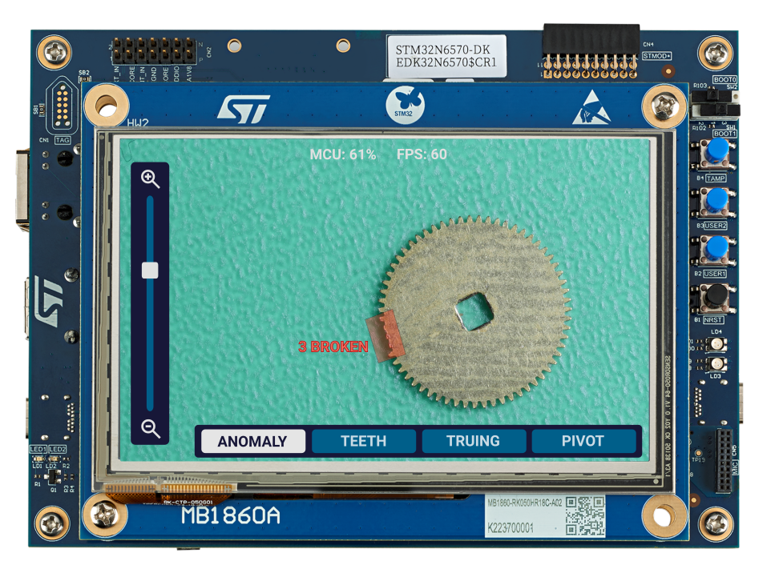

**Teeth Wear Mode**

It detects the overall wear of the wheel’s teeth and it assigns a score on how well it compares with an ideal state. This is a common problem in watches that have not received proper servicing over decades. Old oil or moisture can mix with grit or dirt forming an abrasive substance that can accelerate the wear of the teeth over time.

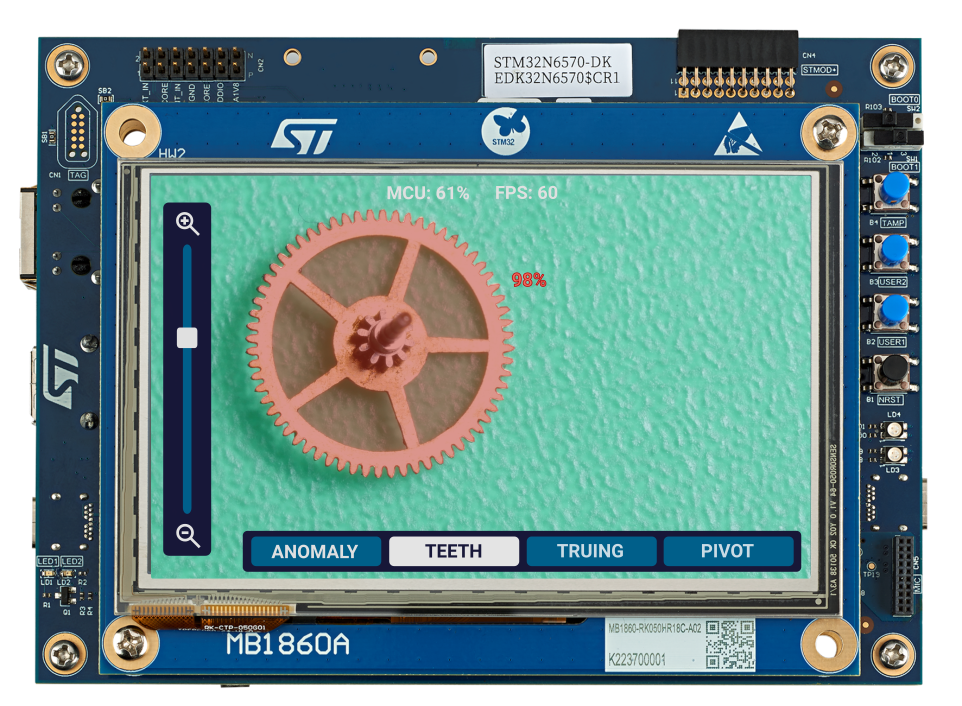

**Truing In The Flat Mode**

It measures how flat is the wheel to the pivots. In an ideal wheel, the pivots should be 90 degrees to the wheel plane. Bent pivots are a common problem in horology, particularly on the elongated pivots of the 4th wheel.

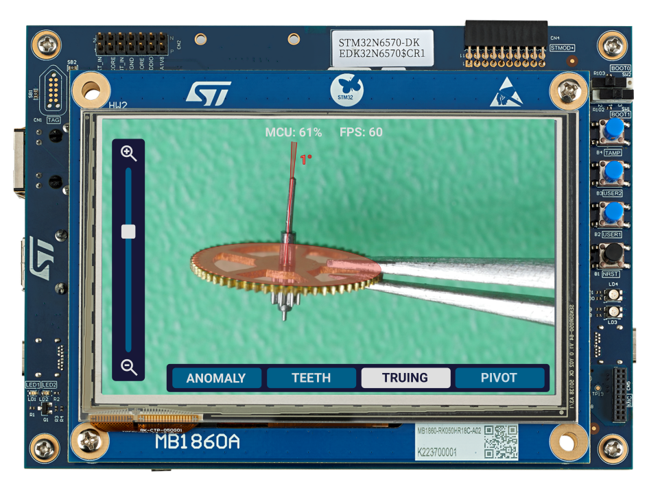

**Pivot Wear Mode**

The pivots of the wheel, made of steel, are rotating in a bearing made of corundum (ruby), a mineral much harder than steel. If old hardened oil mixed with grit or dirt is present in this jewel it can wear the pivots. Worn-off pivots have a distinctive mushroom or conical shape. The device measures the wear of the pivots in degrees relative to their deformation, 0° represents a straight and healthy pivot.

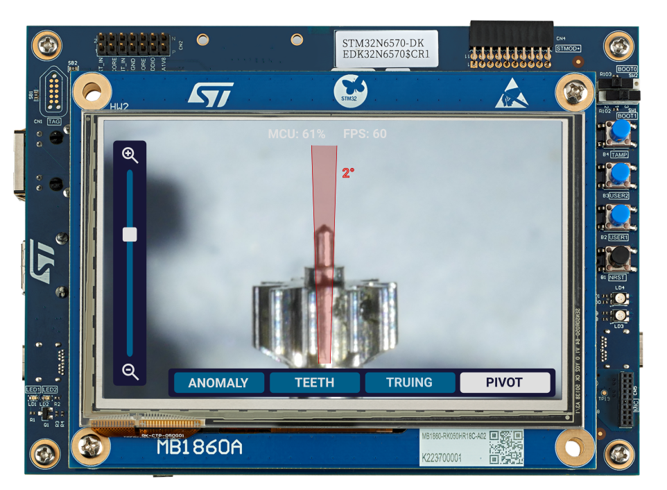

## About watchmaking

In this section, we provide some general knowledge about the traditional methods and equipment for assessing the quality of watch wheels.

### Quality Control and wheel inspection

Servicing mechanical watches is a process where a skilled watchmaker restores a timepiece to factory standards and it is mainly done in the following steps:

1. **Disassembling**: each one of the components of the watch is removed from the movement.
1. **Inspection**: each component is thoroughly inspected through some sort of magnification device, traditionally a watchmaker/jeweller loupe (read the following section for more information).
1. **Fault finding**: In this step, closely related to the previous one, the watchmaker investigates the cause or causes of the malfunctioning of the watch. She pays attention to worn-off or broken components, lack of lubrication, rust and water damage or missing pieces.
1. **Cleaning**: each component is thoroughly cleaned with specialised degreasing and rinsing liquids either manually or with a watchmaking cleaning machine. Rust, if present, is treated with special rust converter products.
1. **Reassembly**: the watch is carefully put back together paying attention to the level of cleanliness of each part.
1. **Oiling**: Several types of oils and greases are applied strategically to specific locations of the watch following the guidelines of the movement datasheet or by using the watchmaker experience
1. **Regulating**: With the help of a timegrapher machine, the watchmaker makes specific adjustments, particularly in the balance assembly, to assess the quality of the restoration as well as to keep accurate time within some standards.

When servicing a watch, Inspecting the wheels is an important part of step 2. The inspection mainly consists of observing the 4 quality control points by using some sort of magnification device.

### Traditional watchmaker’s optics

Some sort of optical system is needed to inspect the wheels as they are too small to observe with the naked eye. The traditional and most widely tool used for this purpose is a watchmaker loupe. A 10x magnification is the minimum required to observe all the different QC points on a wheel.

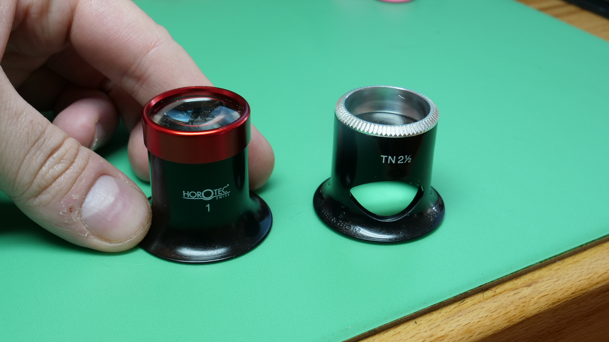

A modern alternative is the use of a stereo microscope like the one shown in the image. Some of these models have a trinocular head that lets you attach a camera for recording purposes.

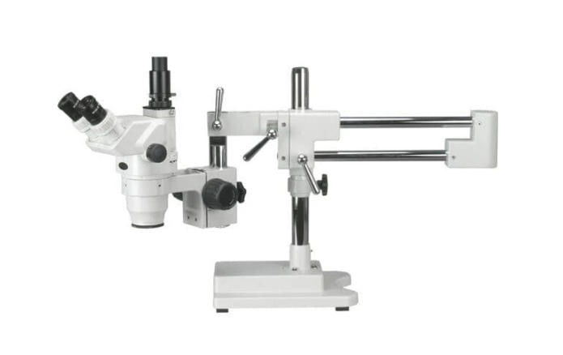

Amateur watchmakers, like me, who [record videos for YouTube](https://www.youtube.com/@jesusthewatchmaker), use a DSLR/Mirrorless camera with a macro lens mounted on a tripod. This provides a good-quality image at a low cost.

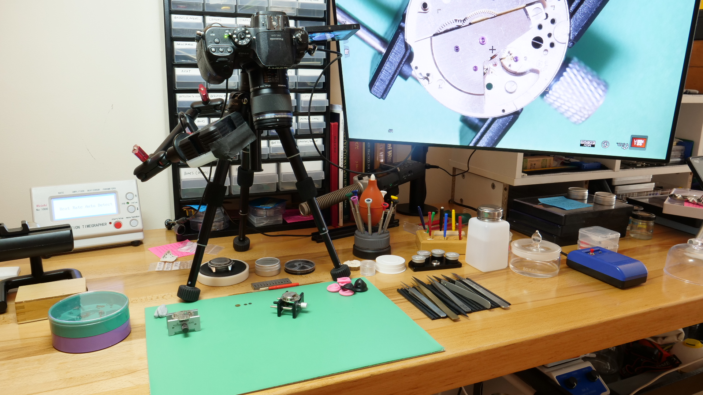

## Optics

In this section, I will briefly explore the potential challenges related to the optics and how I plan to overcome them.

The [STM32N6570-DK](https://www.st.com/en/evaluation-tools/stm32n6570-dk.html) Discovery Kit used in this project includes [B-CAMS-IMX](https://www.st.com/en/evaluation-tools/b-cams-imx.html) camera module. This module consists of:

- A high-resolution 5‑Mpx RGB CMOS image sensor.
- A Dual-lane MIPI CSI-2® interface with a 22‑pin FFC connector.
- A M12 × 0.5 lens holder for a variety of commercially available lenses
- A M12 lens: 1/2.8”, EFL 3.24 mm, F/NO 2.7, view angle 87°.
- A 6-axis inertial motion unit (IMU).
- A Time‑of‑Flight (ToF) sensor is used for gesture control and accurate distance measurements using a laser-ranging sensor.

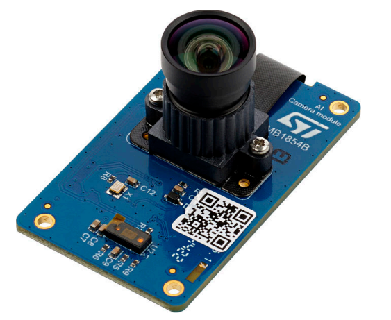

After studying the specs, the lens included in the kit does not have the optical characteristics needed for this project. However, the lenses are interchangeable, thanks to the lens holder this module includes, so we may want to install a macro M12 lens that will let us take close-ups of the watch wheel.

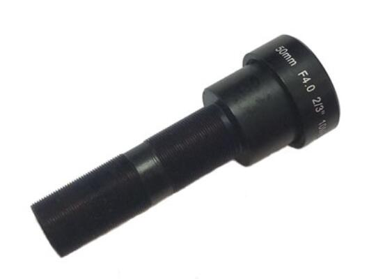

As an alternative to the M12 macro lens, we use my current set-up (see image above) which includes a Lumix GH5 mirrorless camera with an Olympus M.Zuiko Digital ED 60mm f/2.8 Macro Lens. This camera has an HDMI output and therefore an HDMI-CSI adaptor will be needed to feed the video to the discovery kit:

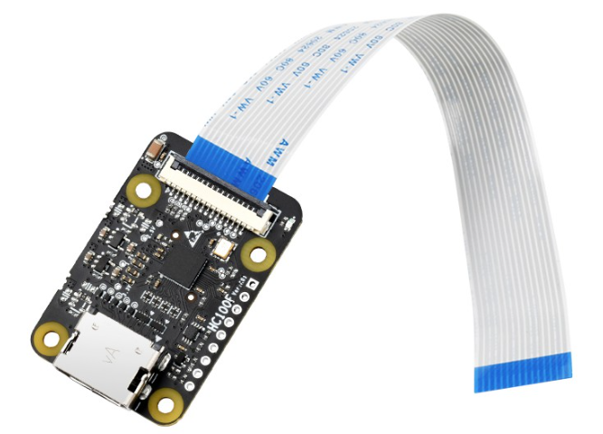

## Software

Certainly, the main challenge in this project is the software and therefore most of the development time will be spent there. Careful study of the SDK and the ST tools will be needed as well as a thorough exploration of the [case studies](https://www.st.com/content/st_com/en/st-edge-ai-suite/case-studies.html#page=1). I can highlight a few points that I can use as entry points to the process of getting familiar with tools:

- [STM32 model zoo](https://github.com/STMicroelectronics/stm32ai-modelzoo): this is a collection of reference machine learning models that are pretrained and ready to be fine-tuned. This may be helpful as a way to explore the current capabilities of the board. The image segmentation model looks interesting for the problem we are trying to solve in this project. Some research will be needed regarding how those models were generated and the potential to fine-tune them. This other [repository](https://github.com/STMicroelectronics/stm32ai-modelzoo-services) contains the scripts that were used to build those models. Also, this [webinar](https://www.youtube.com/watch?v=u1bDyDm961g) shows a brief but complete walkthrough of a semantic segmentation model to detect persons and it covers a demo of the process of curating a dataset, training, validating the model and deploying it in the development kit.
- [X-CUBE-AI](https://www.st.com/en/embedded-software/x-cube-ai.html): This tool is an add-on to [STM32CubeMX](https://www.st.com/en/development-tools/stm32cubemx.html) providing a neural network library generator that converts pre-trained neural networks from most used DL frameworks (such as Keras, TensorFlow™ Lite, and ONNX) into a library that is automatically integrated into the final user project.

With this in mind, we may consider building or fine-tuning a preexisting model (a U-Net network for semantic segmentation looks reasonable), using Keras or TensorFlow, particularly trained to learn about watch wheels. Once the model is built we can import it into the chip thanks to the automated library generator. Most surely some optimizations and proper quantization will be needed to fit the model in the RAM, ROM and CPU constraints of the chip.

Algorithms for pose detection of the wheel will be helpful, particularly in assessing accurate distances and angles in different features of the wheels regardless of their orientation.

Most certainly I will need to curate a solid dataset of labeled watch wheels for training or fine-tuning purposes. My lightbox and macro camera along with the large inventory of old watch wheels I have in my workshop will be useful for this purpose.

## Industry applications

The know-how showed in this prototype can used in a wide variety of QC scenarios in the manufacturing industry. However, there are some products that may naturally born from this proposal. The most obvious one is a digital microscope with AI capabilities. The low cost and low power consumption of the STM32N6 chip may benefit such applications. Even if the microscope is not battery-powered, the low power consumption of the chip will accommodate a design without active cooling reducing the costs and miniaturizing the design even further.

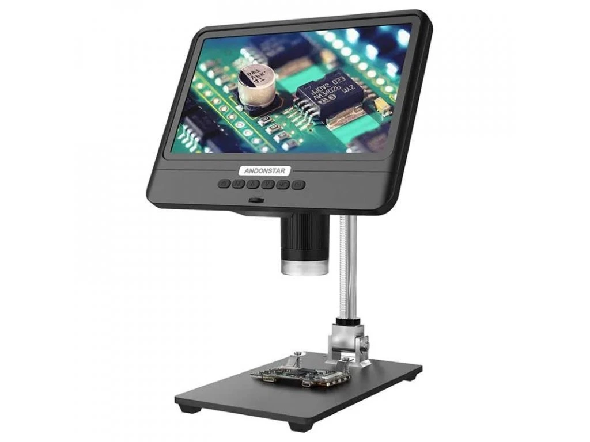

Perhaps the most direct application of this prototype would be an AI-powered watchmaker's loupe with augmented reality. In this case, the low-power nature of the chip can potentially accommodate a battery-powered design. The hardware would be something similar to [IWC's CyberLoupe™](https://www.iwc.com/gb/en/journal/cyberloupe-3-0.html), an internal project from [IWC](https://www.iwc.com/) about which there is little information available.

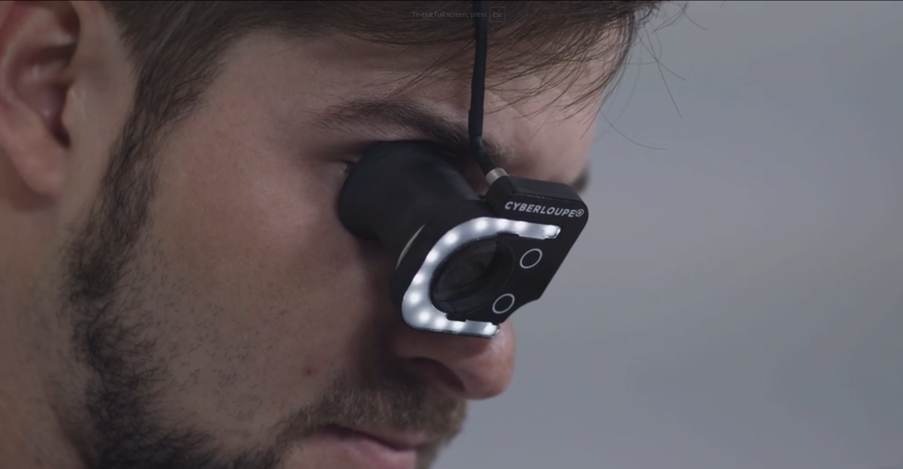

## Roadmap

The project will start as soon as the STM32N6570-DK Discovery Kit arrives (fingers crossed).

1. Set up the development tools and toolchains to run a basic Model Zoo demo on the board.
1. Explore the demos and examples available in the STM model zoo as well as the case studies.
1. Getting familiar with the development tools and methods for this chip, particularly the scripts in the STM Model Zoo repository and X-Cube-AI documentation.
1. Development of a semantic segmentation model.
1. Development of a landmark detection algorithm.
1. Development of a pose detection algorithm.
1. Curating a high-quality training dataset for watch wheels.
1. Optimization/Quantisation iterations.
1. Development of a UI with overlayed information.
1. Write the final documentation of the project.
1. Submit the project to Elektor's competition.
